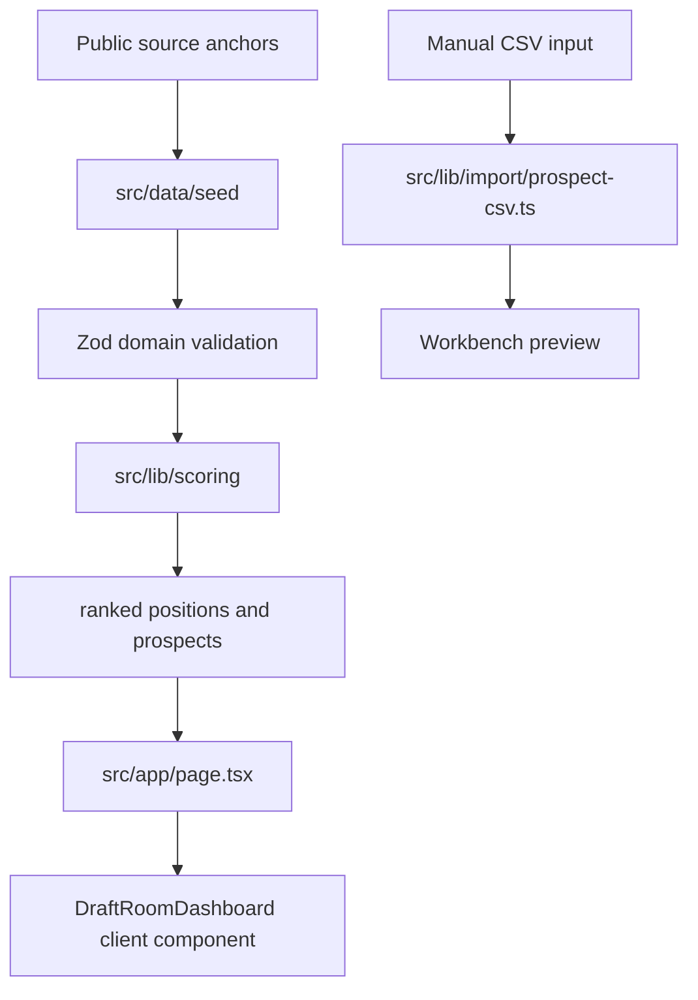

The project separates data, scoring, and UI so the model remains explainable.

## System overview



## Main modules

| Module | Responsibility |
| --- | --- |
| `src/types/domain.ts` | Zod schemas, TypeScript domain types, and `NO_SEASON_MODE` |
| `src/data/seed/` | Source-stamped roster, scheme, draft pick, prospect, and source data |
| `src/lib/scoring/fragility.ts` | Pure deterministic ranking functions |
| `src/lib/import/prospect-csv.ts` | CSV template, parser, and validation result |
| `src/app/page.tsx` | Server component that assembles scored view models |
| `src/components/dashboard/draft-room-dashboard.tsx` | Client-side filters, expandable detail, and CSV preview |
| `src/__tests__/scoring.test.ts` | Domain behavior and product invariant tests |

## Data flow

The route builds the model in this order:

<Steps>
  <Step title="Parse seed data">
    `seedData` validates all row shapes through Zod before the UI consumes them.
  </Step>
  <Step title="Rank positions">
    `rankPositions` joins scheme roles to depth assessments and computes `FragilityScore`.
  </Step>
  <Step title="Rank prospects">
    `rankProspectsForPicks` joins available prospects to the matching position fragility and target picks.
  </Step>
  <Step title="Render dashboard">
    The client component receives scored view models and handles only interaction state.
  </Step>
</Steps>

## Client/server split

`src/app/page.tsx` is a server component. It does scoring before rendering the dashboard.

`DraftRoomDashboard` is a client component because it uses:

- Selected position state.
- Pick filter state.
- Minimum FRV slider state.
- CSV textarea state.

The scoring formula is not duplicated in the component.

## Product invariant

The app exports:

```ts
export const NO_SEASON_MODE = true as const;
```

Tests assert this invariant. The UI displays `Current roster only` instead of offering a season selector.
